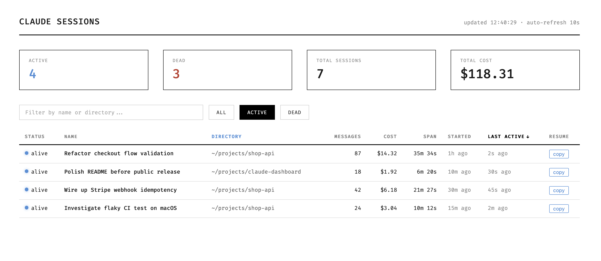

# claude-dashboard

A tiny local dashboard for your [Claude Code](https://docs.anthropic.com/en/docs/claude-code) sessions. Shows which sessions are alive, where they're running, how many messages they've exchanged, and an estimated cost — all read from your local `~/.claude/` directory.



## What it shows

- **Active vs. dead sessions** — based on whether the recorded PID is still running (with a process-start-time cross-check to defend against PID reuse)
- **Per-session stats** — working directory, model, message counts, duration, estimated cost, AI-generated session title
- **Aggregate totals** — total sessions and total cost across history

No network calls. Nothing leaves your machine.

## Install & run

Requires Python 3.10+. No dependencies.

```bash
git clone https://github.com/xocelyk/claude-dashboard.git
cd claude-dashboard
python server.py
```

Then open <http://127.0.0.1:7227>.

The server binds to `127.0.0.1` only — it is not reachable from other machines.

### Demo mode

```bash
python server.py --demo
```

Serves a hardcoded fake dataset instead of reading your `~/.claude/` directory. Useful for previewing the UI before installing Claude Code, or for generating screenshots.

## How it works

It reads two locations under `~/.claude/`:

- `sessions/*.json` — one file per Claude Code session, written by the CLI. Provides session ID, PID, name, working directory, entrypoint, and process start time.
- `projects/**/*.jsonl` — the transcript log for each session. Parsed for message counts, timestamps, model, and token usage. Parses are cached by file mtime so repeated polls are cheap.

A session is "alive" if its recorded PID exists (`os.kill(pid, 0)`) **and** that PID's `lstart` from `ps` matches what the session JSON recorded — this avoids false positives when the OS recycles a PID for an unrelated process.

## Cost estimation

Cost is estimated from the `usage` field on each assistant message in the JSONL transcript, using per-family rates published by Anthropic. The model ID on each assistant turn (e.g. `claude-opus-4-7`, `claude-sonnet-4-6`, `claude-haiku-4-5`) is substring-matched against `MODEL_RATES` in `server.py` to pick the rate table. Unknown models fall back to Sonnet pricing.

Rates are baked into the source — if Anthropic changes pricing, edit `MODEL_RATES` in `server.py`. Cost is an *estimate*; it's derived from per-message `usage` reporting, not from billing.

## Caveats

- The `~/.claude/sessions/` and `~/.claude/projects/` formats are undocumented Claude Code internals. They may change between CLI versions and break this dashboard.
- Cost is an estimate — it's derived from per-message `usage` reporting, not from billing.
- The "duration" of a session is measured as the time between the first and last assistant message, which can be misleading for long idle gaps.

## License

MIT — see [LICENSE](LICENSE).
